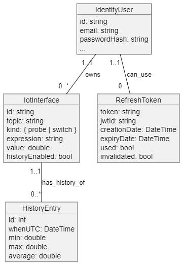

# Programmer's manual

This is an in depth manual about the architecture and individual components' implementation of the IOT-Dash application backend.

Related documents:
- [README](?)

[TOC]

# Application context
The backend is a middle man between the web application and the devices. It is responsible for managing devices and presenting data for users of front end application. See in the following component illustration.

```
                                                     devices
┌───────────────┐       ┌─────────────────┐          ┌─────┐
│ iot-dash-app  │       │                 │◄────┬────┤     │
└──────┬────────┘       │   MQTT Broker   │     │    ├─────┤
       │                │                 │     ├────┤     │
       │ http           └───┬─────────────┘     │    ├─────┤
       │                  ▲ │                   ├────┤     │
       │                  │ │ publish &         │    ├─────┤
       ▼                  │ │ subscribe         └────┤     │
   REST api               │ ▼                        ├─────┤
┌─────────────────────────┴───────────────┐          │  .  │
│            iot-dash-backend             │          │  .  │
└────────────────────┬────────────────────┘          │  .  │
                     │                               │     │
┌────────────────────┴────────────────────┐          │     │
│              MySQL database             │          │     │
└─────────────────────────────────────────┘          └─────┘
```
# Conceptual model

The conceptual model of the application is illustrated in the following UML diagram. Classes with relevant documentation are in the IotDash.Data.Model namespace. Application uses Entity Framework Core to generate SQL schema from C# classes.



# Architecture

Service-oriented architecture of the backend uses dependency injection provided by the ASP.NET Core library. The functionality is separated into coherent groups called *services* which exchange information through a mediator pattern (IotDash.Services.Messaging.MessageMediator class).

Services are registered by scanning the assembly for implementations of the IotDash.Installers.IInstaller interface, which are located in the IotDash.Installers namespace.
Then the installers are instantiated and their `Install()` methods are called.

The dependency container registers services by Type, but not directly by the service type. The services are registered by an interface or an abstract type to allow easy swap of implementation of different services.

## Web server pipeline

The web server uses the middleware pattern to realize the server pipeline.
Each request is passed through the pipeline call stack. The pipeline is configured in the IotDash.Startup class.


Different parts of the pipeline are realised by the following classes:
 - **CORS**: Microsoft.AspNetCore.Builder.CorsMiddlewareExtensions
 - **Routing**: Microsoft.AspNetCore.Routing.EndpointRoutingMiddleware
 - **Error reporting**: IotDash.Middleware.ApiErrorReporting
 - **Authentication**: Microsoft.AspNetCore.Authentication.AuthenticationMiddleware
 - **Authorization**: Microsoft.AspNetCore.Authorization.AuthorizationMiddleware
 - Different endpoints are registered by providing appropriate implementation of Microsoft.AspNetCore.Routing.IEndpointRouteBuilder to the Microsoft.AspNetCore.Routing.EndpointMiddleware on top of the pipeline.

Static files hosted by this backend application are the files of the frontend application.

### Authorization and Authentication

Authentication is realised via standard ASP.NET authenticator service with the JWT extension. The ASP.NET authenticators are configured and registered in the AuthenticationInstaller.

Authorization is realised via IotDash.Authorization.Policies registering different IotDash.Authorization.Requirements onto various controller routes.
The requirements are realised by their relevant AuthorizationHandlers.

### Controllers and Hubs

Controllers provide endpoints for HTTP routes. They are registered automatically on the <see cref="IotDash.Startup.Configure" />.
    - IotDash.Controllers.V1.IdentityController
    - IotDash.Controllers.V1.InterfaceController

Hubs provide endpoints for SignalR clients, which enable two-way real-time communication with the clients. In this application, this functionality is only used for providing real-time MQTT data to the clients.
    - IotDash.Controllers.V1.EventHub

## Services

The most of the application's functionality is wrapped in services (see [Architecture](#autotoc_md3)). This section contains their complete list.

### Model stores

Model store classes provide abstraction over the database. Other services instead of directly accessing the database depend on these IotDash.Services.IModelStore objects, which provide basic CRUD functionality over the database, plus some additional features like change detection.

These scoped services are registered in DI service container by IotDash.Installers.DataInstaller. The following interfaces represent the API of these services:
    - IotDash.Services.IInterfaceStore
    - IotDash.Services.IUserStore
    - IotDash.Services.IIdentityService
    - IotDash.Services.IHistoryStore

All these stores depend on IotDash.Data.DataContext which is also registered in by same installer. It is a scoped service, which means it is created once per HTTP request.

### MQTT Client

The MQTT client is realised via the MQTTnet library. It provides the following service
    - IotDash.Services.Mqtt.MqttMediator implemented by IotDash.Services.Mqtt.Implementation.MqttNet_Mediator

The service is composed of classes in the IotDash.Services.Mqtt.Implementation namespace.

